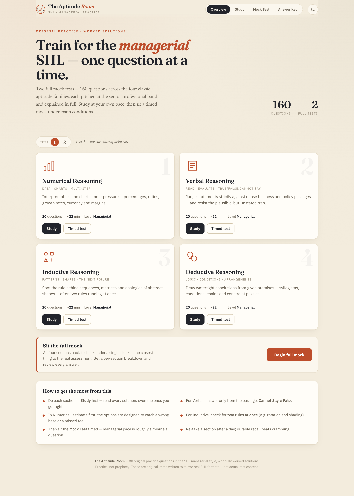

# The Aptitude Room — SHL Managerial Practice

A self-contained practice bank for **managerial / senior-professional level SHL aptitude tests**.
**160 original questions** across **two full mock tests** — 20 questions in each of the four classic families, per test — with a fully worked solution for every one. Switch between **Test 1** (the core set) and **Test 2** (all-new scenarios, a notch harder) from the home, study, mock and answer-key screens.

> **Open `index.html` in any browser.** That single file *is* the app — no install, no server, no internet required (it works offline; web fonts simply fall back to system fonts if you're offline).

**▶ Live demo:** https://manishmanwani36.github.io/aptitude-room/

## What's inside

Each test has 20 questions per section (80 per test, 160 total). Test 2 raises the difficulty — more chained steps, subtler traps, three-rule matrices and XOR superimposition figures — with entirely new scenarios.

| Section | Per test | Format | Diagrams |
|---|---|---|---|
| **Numerical Reasoning** | 20 | Multi-step data interpretation — percentages, ratios, CAGR, currency-with-fees, weighted margins, break-even, index numbers, variance; Test 2 adds real-vs-nominal deflation, price/volume decomposition, reverse-margin and contribution-per-constrained-resource | SVG bar / grouped / stacked / line / pie charts + data tables |
| **Verbal Reasoning** | 20 | Dense passages judged True / False / Cannot Say, plus critical-reasoning MCQs (assumption / inference / strengthen-weaken / flaw / paradox) | — |
| **Inductive Reasoning** | 20 | Abstract-shape sequences, 3×3 matrices, odd-one-out and analogies — often two or three rules at once | SVG figures, generated by a rule engine |
| **Deductive Reasoning** | 20 | Syllogisms, conditional/propositional logic, constraint/arrangement puzzles, data-sufficiency | — |

## How to use it

- **Study mode** — work a section at your own pace. Pick an answer to check it, then reveal the full worked solution. Progress is saved on your device.
- **Mock Test** — timed (≈1 min/question, the managerial pace) and auto-scored, with a per-section breakdown and full answer review. Take a single section or the full 80-question mock.
- **Answer Key** — every question with its answer and reasoning on one page; "Print / Save PDF" gives you a clean printable question bank.
- **Dark / light** — toggle top-right; remembered between visits.

Tips and a recommended study routine are on the home screen.

## How it was built (and why you can trust the answers)

1. **Research** — agents surveyed real SHL formats and managerial-band difficulty for each section.
2. **Authoring** — themed batches of original questions written to those specs.
3. **Adversarial verification** — every numerical, verbal and deductive item was *independently re-solved from scratch* by a separate checker; mismatches were corrected (this pass caught and fixed real defects, e.g. a logic item that had two valid answers).
4. **Inductive engine** — abstract-reasoning items are generated from an explicit rule, and the correct option is produced *by that rule*, so the key is correct by construction.
5. **Headless test harness** — all 80 questions are checked to render correctly, have a valid single answer, and contain no duplicate/ambiguous options.
6. **Browser verification** — Playwright drives the real app in Chrome through every flow on **both tests** (study, timed quiz with auto-submit, results, answer key, dark mode, mobile, test switching); 47 functional + UI checks pass with no console errors.

## Honesty note

These are **original questions written to mirror SHL formats and difficulty** — they are **not** real, copyrighted SHL test items. Practising them builds the right skills and pattern-recognition; it is not a substitute for the genuine assessment, and no practice set can guarantee a score.

## Files

- `index.html` — **the app.** Self-contained (HTML + CSS + JS + all question data inline). This is the only file you need; GitHub Pages serves it directly.
- `screenshots/` — captures of every screen (used in this README).
- `test.cjs` — the Playwright verification harness. Run with `npm i playwright && node test.cjs` (drives the app in your system Chrome).

To add or change questions, edit the data arrays inside `index.html`.
